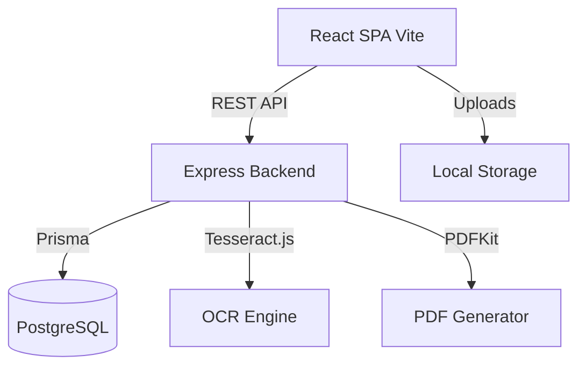

# ShopSmart

An AI-powered billing and inventory management platform for local retail shops.

## Architecture & Tech Stack

- **Frontend:** React 19, TypeScript, Vite, Tailwind CSS (Custom "Counter Ink" design system), Framer Motion, Recharts, React Query.
- **Backend:** Node.js, Express, TypeScript, Prisma ORM.
- **Database:** PostgreSQL.
- **Services:** Tesseract.js (OCR), PDFKit (Invoicing).
- **Deployment:** Docker Compose (local), Render (production).



## Setup & Running Locally

1. **Install dependencies:**
   ```bash
   npm install
   cd client && npm install
   cd ../server && npm install
   ```

2. **Environment Variables:**
   Copy the `.env.example` to `.env` in the root folder.
   ```bash
   cp .env.example .env
   ```

3. **Start PostgreSQL via Docker:**
   ```bash
   npm run docker:up
   ```

4. **Run Database Migrations & Seed Data:**
   ```bash
   npm run db:migrate
   npm run db:seed
   ```
   *The seed script creates a demo shop with 30 products across 7 categories, 8 past bills, and two users.*

5. **Start Development Servers (Client + Backend):**
   ```bash
   npm run dev
   ```

6. **Access Application:**
   - Web App: `http://localhost:5173`
   - API Server: `http://localhost:3001`
   - Demo Owner Login: `rajesh@shopsmart.demo` / `password123`
   - Demo Staff Login: `priya@shopsmart.demo` / `password123`

## Features

- **Smart Billing Terminal:** Add items by search or via AI-powered OCR scanning of paper bills.
- **Live Receipt Preview:** A real-time receipt simulation during billing, with a satisfying "PAID" stamp animation.
- **Automated Inventory Sync:** Atomic stock deductions with row-level locking to prevent overselling.
- **Dynamic PDF Invoices:** Server-side PDF generation styled like thermal receipts.
- **Sales Visualizer:** Beautiful charts showing daily revenue, transaction volume, and top-selling products.
- **Expiry Date Tracker:** Custom widgets grouping items by expiry urgency (expired, <7 days, <30 days).

## Testing

Run server unit tests:
```bash
npm test
```

Run E2E smoke tests (Playwright):
```bash
npm run test:e2e
```

## Deployment (Render / Railway)

A `render.yaml` blueprint is included for deploying to Render as two web services and a managed PostgreSQL instance.
